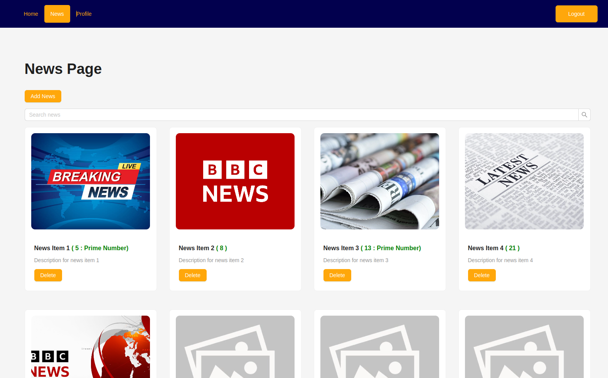
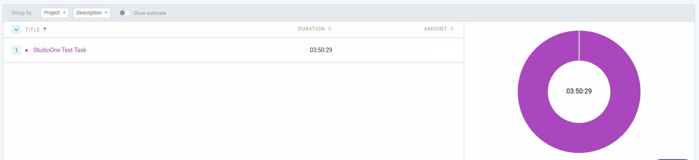

# Test Task for "Studio One".

# Spent Time.

## Available Scripts

RUN the "frontend" in terminal ==>

### `npm start`

RUN the "backend" in terminal ==>

### `json-server --watch public/news.json --port 5000`

## More Information

This project was bootstrapped with [Create React App](https://github.com/facebook/create-react-app).

Used: Typescript, Ant Design, Redux Thunk, Axios, React Modal,